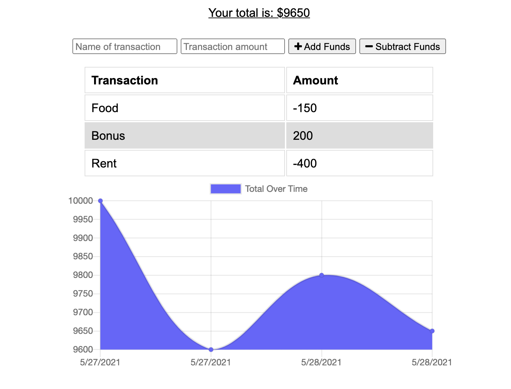

# budget_tracker

## Description

This is a Budget Tracker application that allow users to add funds and subtract expenses. This is a progressive web app that will allow for for both online and offline access - where the user can download the app outside the browser. Further, it keeps saving user data locally using the "indexedDB" browser API and sync it back up to the MongoDB database when coming back online (using workerscript).

## Technologies

This application uses the following Node.js packages:

- [Node.js](https://nodejs.org/en/)
- [Express](https://expressjs.com/)
- [Mongoose](https://www.npmjs.com/package/mongoose)
- [Morgan](https://www.npmjs.com/package/morgan)
- [Compression](https://www.npmjs.com/package/compression)

This application takes advantage of the following technologies:

- [Progressive web app](https://web.dev/progressive-web-apps/)
- [Web app manifest](https://web.dev/add-manifest/)
- [Service Worker](https://developer.mozilla.org/en-US/docs/Web/API/Service_Worker_API)
- [IndexedDB](https://developer.mozilla.org/en-US/docs/Web/API/IndexedDB_API)

## Usage and Installation

Feel free to clone or fork this repo if you find it useful. To install dependencies make sure to run:

"npm i"

## Demo

You can see a demo of this app [here]()

## Page Screenshots

Installed app on MacOS:

